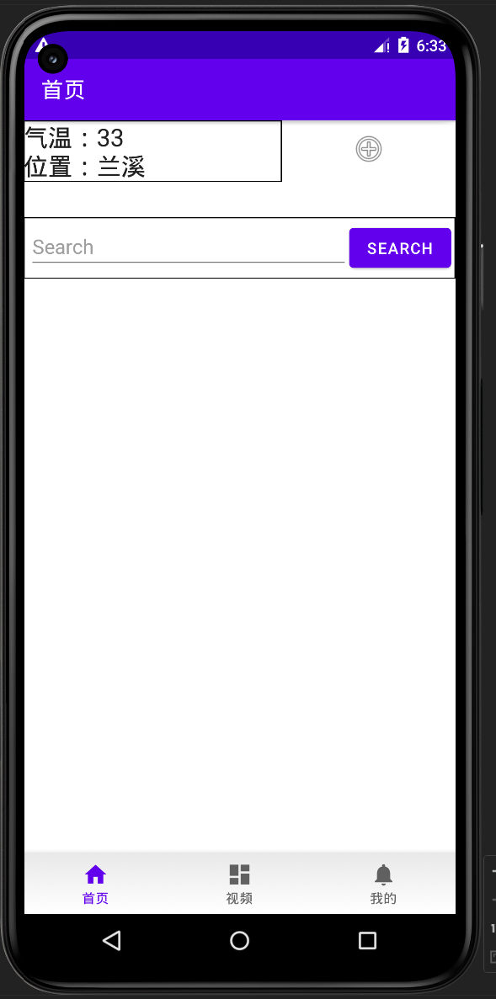

# FinalProject

## 介绍

百度前端大作业。南京大学暑期课程。

大概是最后花了一个多星期速成的，这个项目写了四十个小时。加上之前自己技术选型，尝试其他写法的时间，可能总共花了50-60h左右。最后拿了优秀学员，好像有实习机会，感觉还不错。

这个课程上课讲的有点简单，对于最后做大作业是不太够的，感觉主要还是得自己去多看官方文档，多Google（虽然这是百度的课程），多问问chat也挺有用的。

## 软件架构

软件架构说明

项目由一个`Mainactivity`和多个`Fragment`组成。

`data`下是数据，主要是Jetpack Room处理本地数据库。

`ui`下是UI层和ViewModel(逻辑)。

UI层对于的布局文件了：

`utils`是一些公共方法。

## 安装教程

1. 找到APK包：`app/release/app-release.apk`
2. 在手机上安装

## 项目说明

### 首页

没有添加新闻时的首页：

#### 添加新闻

新闻的数据层使用Room存储。

点击右上角的`+`按钮，进入新闻编辑界面：

输入相关信息：

无图片的推文：

提交后的首页：

### 天气

点击首页左上角的文字，进入天气页。

加载动画：

天气页：

下方的recycleView可以滑动

### 搜索

输入关键词，点击按钮搜索。

### 视频

测试时发现在某些版本模拟器上音频驱动出错无法播放，在实机上播放正常。

可以一直向下滑动：

单击视频跳转到单独界面：

### 我的

##### 登录页

`我的`页实现了用户登录、注册、昵称修改，数据层使用Room。

如果出现错误，下方有`toast`提示;登陆成功也会有提示。

* 用户不存在/密码错误

* 注册成功

#### 登录后

修改用户昵称：

点击退出后回到登录页。